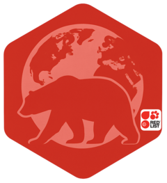

# IUCN Red List R Package

# 

<!-- badges: start -->

[](https://github.com/stangandaho/redlist/actions/workflows/R-CMD-check.yaml) [](https://CRAN.R-project.org/package=redlist) [](https://cran.r-project.org/package=redlist)

<!-- badges: end -->

[](https://app.codecov.io/gh/stangandaho/redlist)

## About This Project

Started in September 2024, this project originated when [`rredlist`](https://github.com/ropensci/rredlist) was still tied to the deprecated IUCN Red List V3 API. By January 2025, `rredlist` had transitioned to support the V4 API, introducing substantial structural changes. I continued developing my own approach, which led to [`redlist`](https://github.com/stangandaho/redlist) — a standalone client designed around consistent tibble outputs and streamlined workflows.

In parallel, there is also the official IUCN-supported package [`iucnredlist`](https://iucn-uk.github.io/iucnredlist/), which provides direct access to the same V4 API. Although these packages all use API V4, they differ in design: `redlist` focuses on a fresh, independent approach with uniform inputs and outputs for all endpoints, while `iucnredlist` represents the official reference implementation.\
These differences mean the packages are not in competition but are complementary, serving different user preferences.

## Get started

### 📦 Installation

``` r
# Install with pak package
if (!requireNamespace("pak", quietly = TRUE)) {
  install.packages("pak", dependencies = TRUE)
}

# Install from CRAN
pak::pkg_install("redlist")

# Install from GitHub
pak::pkg_install("stangandaho/redlist")

# Load
library(redlist)
```

### 🔑 Set Your API Key

If you're using this package for the first time, you'll likely need an IUCN Red List API key.  
You can check whether it's set by running `rl_check_api()`.\
If this throws an error like '*! No Redlist API key found...* ', you'll need to set an API key before using any of the package data requery functions. Just follow these two simple steps:  

1. Visit the official IUCN Red List API website [here](https://api.iucnredlist.org/users/edit). Create an account if you don't already have one. Once logged in, you can request your API key.  

2. Copy your API key and set it using the `rl_set_api()` function, like this `rl_set_api("2GoWiThmYrEDlitApiThatWorkS4me")`.  

You can then run `rl_check_api()` again to confirm that your API key is set successfully.

> *Please ensure that you have read and agreed to the [API key terms of use](https://www.iucnredlist.org/terms/terms-of-use) and have complied with them during your usage.*

## Usage

The `redlist` package offers simple functions to retrieve and explore IUCN Red List data, and calculate risk metrics.

``` r
# Retrieve Red List data for Benin (country code "BJ"), first page by default
benin_redlist <- rl_countries(code = "BJ") # Get first 100 records
head(benin_redlist) # Preview the data

# Retrieve data from first 5 pages (up to 500 records)
benin_redlist_pages <- rl_countries(code = "BJ", page = 1:5)

# Retrieve data from first 5 pages, filtered by year published 2023
benin_redlist_2023 <- rl_countries(code = "BJ", page = 1:5, year_published = 2023)

# Retrieve all available data for Benin (no page limit)
benin_redlist_all <- rl_countries(code = "BJ", page = NA)

# Get detailed species info by passing a species sis_id (example: 137286)
species_info <- rl_sis(sis_id = 137286)

# Get detailed assessment info by passing an assessment_id (example: 522738)
assessment_info <- rl_assessment_id(assessment_id = 522738)

# Loop through multiple assessment_ids to collect detailed data for all species
all_species_details <- lapply(benin_redlist$assessments_assessment_id, function(id) {
  rl_assessment_id(assessment_id = id)
}) %>% dplyr::bind_rows()
```

### From a species name to Criterion B metrics

Beyond retrieving assessments, `redlist` can gather occurrence records and compute the range metrics used in Criterion B. The occurrence functions use the public GBIF search service.

``` r
# 1. Get the IUCN assessment. resolve = TRUE recovers the accepted IUCN name
#    when the given name is a synonym (here Corvinella corvina is filed by IUCN
#    as Lanius corvinus).
sp <- rl_scientific_name(genus_name = "Corvinella", species_name = "corvina",
                         resolve = TRUE)

# 2. Fetch GBIF occurrence records.
occ <- rl_occurrences(sp,
                      year = ">2000",
                      basis_of_record = c("HUMAN_OBSERVATION", "MACHINE_OBSERVATION"),
                      limit = 2000)

# 3. Check data quality and clean.
occ_clean <- rl_check_occurrences(occ,
                                  correct = c("duplicates", "outliers", "country", "centroids"))

# 4. Compute the Criterion B metrics.
rl_eoo(occ_clean) # extent of occurrence
rl_aoo(occ_clean) # area of occupancy
```

### Population reduction (Criterion A)

`rl_reduction()` estimates the reduction over generations under an exponential or linear decline. `rl_overall_reduction()` combines subpopulations weighted by size.

``` r
# 1556 individuals in 2011 and 898 in 2021, generation length 10 years,
# assessed in 2026. This returns an 80.8% reduction (CR under criterion A2).
rl_reduction(population = c(1556, 898), time = c(2011, 2021),
             generation_length = 10, model = "exponential",
             assessment_year = 2026)

# Combine three subpopulations into one figure for the taxon
rl_overall_reduction(past = c(10000, 8000, 12000),
                     present = c(5000, 9000, 2000))
```

These snippets only show the essentials. For the full story, including what each
argument does, the IUCN thresholds, and how to read the results, see the articles
on [extent of occurrence and area of occupancy](https://stangandaho.github.io/redlist/articles/eoo-and-aoo.html)
and on [population reduction under criterion A](https://stangandaho.github.io/redlist/articles/criterion-a-reduction.html).

**For a full overview of all available functions, please visit the [redlist website](https://stangandaho.github.io/redlist/reference/index.html)**

## Code of conduct

Please note that this project is based on the [Contributor Covenant v2.1](https://github.com/stangandaho/redlist/blob/main/CODE_OF_CONDUCT.md). By participating in this project you agree to abide by its terms.

## Getting help

If you encounter a clear bug, please file an [issue](https://github.com/stangandaho/redlist/issues) with a minimal reproducible example. For questions and other discussion, please use [relevant section](https://github.com/stangandaho/redlist/discussions).