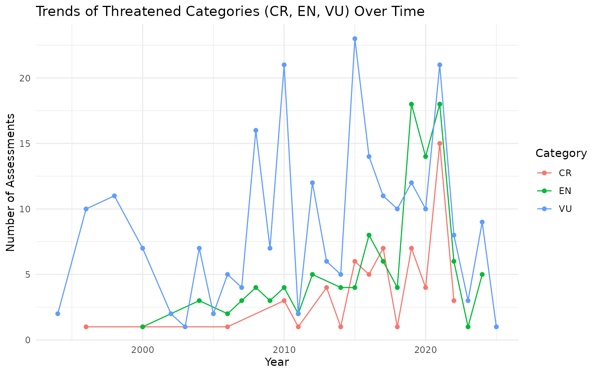

# IUCN red list data visualisation

## Introduction

In this vignette, I will examine assessments specific to **Benin**. I
will walk through three types of visualizations:

- Total number of assessments per year
- Proportional breakdown of IUCN categories
- Trends over time for **threatened** categories (CR, EN, VU)

Refer to [this
vignette](https://stangandaho.github.io/redlist/articles/get_data.html)
to learn more about how to access the data.

## Query Data

``` r
# Load the package
library(redlist)
# Get all data on Benin
benin_rl <- rl_countries(code = "BJ", page = NA)
```

``` r
# Basic overview
glimpse(benin_rl)
#> Rows: 9,786
#> Columns: 15
#> $ country_description_en                   <chr> "Benin", "Benin", "Benin", "B…
#> $ country_code                             <chr> "BJ", "BJ", "BJ", "BJ", "BJ",…
#> $ assessments_year_published               <dbl> 2013, 2025, 2014, 2013, 2014,…
#> $ assessments_latest                       <lgl> FALSE, TRUE, TRUE, TRUE, TRUE…
#> $ assessments_possibly_extinct             <lgl> FALSE, FALSE, FALSE, FALSE, F…
#> $ assessments_possibly_extinct_in_the_wild <lgl> FALSE, FALSE, FALSE, FALSE, F…
#> $ assessments_sis_taxon_id                 <dbl> 137286, 137829, 137859, 13795…
#> $ assessments_url                          <chr> "https://www.iucnredlist.org/…
#> $ assessments_taxon_scientific_name        <chr> "Caccobius ferrugineus", "Gar…
#> $ assessments_red_list_category_code       <chr> "LC", "LC", "LC", "LC", "LC",…
#> $ assessments_assessment_id                <dbl> 522738, 531737, 532227, 53393…
#> $ assessments_code                         <chr> "BJ", "BJ", "BJ", "BJ", "BJ",…
#> $ assessments_code_type                    <chr> "country", "country", "countr…
#> $ assessments_scopes_description_en        <chr> "Global", "Global", "Global",…
#> $ assessments_scopes_code                  <dbl> 1, 1, 1, 1, 1, 1, 1, 1, 1, 1,…
```

The dataset includes **all species** assessed in Benin across various
taxonomic groups — including **plants, animals, fungi**, and other
organisms.

## Number of Assessments per Year

Understanding the volume of assessments over time gives insight into
conservation attention and effort.

``` r
benin_rl %>%
  count(assessments_year_published) %>%
  ggplot(aes(x = assessments_year_published, y = n)) +
  geom_line(color = "steelblue") +
  geom_point(color = "darkblue") +
  labs(
    title = "Number of assessments per year in Benin",
    x = "Year",
    y = "Number of assessments"
  ) +
  theme_minimal()
```


## Proportion of Red List Categories

Most species in Benin fall under **Least Concern (LC)**, but some are
classified as threatened. This chart highlights the proportion of
assessments by category.

``` r
benin_rl %>%
  filter(!is.na(assessments_red_list_category_code)) %>%
  count(assessments_red_list_category_code) %>%
  mutate(prop = n / sum(n)) %>%
  ggplot(aes(x = reorder(assessments_red_list_category_code, -prop), y = prop)) +
  geom_col(fill = "salmon") +
  scale_y_continuous(labels = scales::percent_format()) +
  labs(
    title = "Proportion of red list categories in Benin",
    x = "Red List Category",
    y = "Proportion"
  ) +
  theme_minimal()
```


## Trends in Threatened Categories Over Time

Focusing on **Critically Endangered (CR)**, **Endangered (EN)**, and
**Vulnerable (VU)** species helps track biodiversity risk.

``` r
benin_rl %>%
  filter(assessments_red_list_category_code %in% c("CR", "EN", "VU")) %>%
  count(assessments_year_published, assessments_red_list_category_code) %>%
  ggplot(aes(x = assessments_year_published, y = n,
             color = assessments_red_list_category_code)) +
  geom_line() +
  geom_point() +
  labs(
    title = "Trends of Threatened Categories (CR, EN, VU) Over Time",
    x = "Year",
    y = "Number of Assessments",
    color = "Category"
  ) +
  theme_minimal()
```


